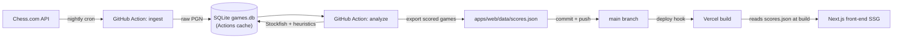

# check-or-mate

> A data pipeline that finds the most spectacular chess games you'd never have found on your own.

[](https://github.com/sebthiertant/check-or-mate/actions)
[](https://github.com/sebthiertant/check-or-mate/actions)
[](LICENSE)

`check-or-mate` ingests games from the public [Chess.com API](https://www.chess.com/news/view/published-data-api), scores them across multiple dimensions of "spectacle" using Stockfish and PGN heuristics, and exposes a filterable browser of curated games.

**📖 Architecture:** [docs/architecture.md](docs/architecture.md)
**📝 Decisions log:** [docs/adr/](docs/adr/)

---

## Why this project exists

Watching random chess games is boring. Watching *curated* games — Tal-style sacrifices, time-scramble swings, upsets against 200-Elo-higher opponents — is electric. There's no good tool for this: Chess.com surfaces engagement, not aesthetics.

This project answers a question I had for myself: *can I build a data pipeline that learns my taste in chess games?*

---

## What it does

Given a watchlist of players (top GMs, streamers, anyone with a public Chess.com profile), `check-or-mate`:

1. **Fetches** their game archives nightly via the Chess.com public API
2. **Parses** PGN with `python-chess`, extracting moves, clocks, results, and metadata
3. **Analyzes** each game with Stockfish, producing per-move centipawn evaluations
4. **Scores** games along seven dimensions (see below)
5. **Publishes** a JSON snapshot of the scored games (`apps/web/data/scores.json`), read by a Next.js front-end at build time

Users can filter by score combinations ("show me games with high sacrifice score AND high time-pressure drama, by anyone under 2700"), step through the moves with `react-chessboard`, and jump directly to the Chess.com replay.

---

## The scoring model

Each game receives a vector of normalized scores from 0 to 100:

| Dimension | What it captures | How it's computed |
|---|---|---|
| `sacrifice_score` | Material given up for compensation | Peak negative material balance followed by a non-losing result |
| `eval_swing` | Drama in evaluation | Standard deviation of Stockfish centipawn eval across the game |
| `brilliancy` | Stockfish-flagged brilliant moves | Moves where eval jumps > 200 cp in favor of the side to move |
| `time_pressure` | Clock drama | Count of moves played with < 10 seconds on the clock |
| `endgame_quality` | Precise endgame play | Accuracy in positions with ≤ 6 pieces on the board |
| `rating_upset` | David vs. Goliath | Elo delta between winner and loser, signed by result |
| `opening_rarity` | Off-the-beaten-path | Inverse frequency of the ECO code in the corpus |

All seven are tunable — see `packages/analysis/config.yml`.

---

## Architecture at a glance



Full diagram and component responsibilities in [docs/architecture.md](docs/architecture.md).

---

## Repository layout

```
check-or-mate/
├── .github/
│   ├── workflows/          # CI, nightly ingestion, release automation
│   ├── ISSUE_TEMPLATE/     # Bug, feature, ADR proposal
│   └── dependabot.yml
├── .devcontainer/          # One-click setup in Codespaces
├── apps/
│   └── web/                # Next.js + TypeScript + Tailwind + shadcn/ui
│       └── data/
│           └── scores.json # published scored-games snapshot (committed, read at build)
├── packages/
│   ├── ingestion/          # Python — Chess.com client, PGN parsing
│   ├── analysis/           # Python — Stockfish driver, scoring
│   └── shared-types/       # TypeScript types generated from Python schemas
├── data/
│   └── watchlist.yml       # tracked players; games.db is gitignored (Actions cache, see ADR-0002)
└── docs/
    ├── architecture.md
    └── adr/                # Architecture Decision Records
```

---

## Tech stack

| Layer | Choice | Reason |
|---|---|---|
| Front-end | Next.js 15, TypeScript, Tailwind, shadcn/ui | Modern, recruitable, fast SSG |
| Chess board | `react-chessboard` + `chess.js` | De facto standard, well-maintained |
| Ingestion | Python 3.12, `httpx`, `python-chess` | `python-chess` is unmatched for PGN |
| Analysis | Python + Stockfish 16 | Industry-standard engine |
| Storage | SQLite working store (Actions cache) + committed `scores.json` snapshot | Zero infra; a small JSON feeds the static build instead of a heavy DB, see [ADR-0002](docs/adr/0002-storage.md) |
| CI/CD | GitHub Actions | Native to the platform we're showcasing |
| Hosting | Vercel (front) + GitHub Pages (docs) | Free tier, preview deployments |

---

## Running locally

The fastest path is GitHub Codespaces — click the green **Code** button → **Codespaces** → **Create codespace on main**. Everything (Python, Node, Stockfish) is pre-installed via `.devcontainer/`.

Otherwise:

```bash
# Prerequisites: Node 20+, Python 3.12+, Stockfish 16
git clone https://github.com/sebthiertant/check-or-mate
cd check-or-mate

# Install
pnpm install
uv sync --all-packages

# Run the ingestion for a single player
uv run python -m ingestion fetch --player magnuscarlsen --month 2025-04

# Run the analysis pipeline
uv run python -m analysis score --since 2025-04-01

# Start the front-end
pnpm --filter web dev
```

---

## Project status

This is an active personal project. The roadmap is tracked in the milestones below; milestones map to release tags.

| Milestone | Status | Highlights |
|---|---|---|
| M1 — Foundation | 🟢 done | repo, CI, devcontainer, ADRs |
| M2 — Ingestion | 🟡 in progress | Chess.com client, PGN parsing |
| M3 — Heuristic scoring | ⚪ planned | Six non-engine dimensions |
| M4 — Front-end MVP | ⚪ planned | Game list + board viewer |
| M5 — Stockfish integration | ⚪ planned | Eval pipeline, brilliancy detection |
| M6 — Filter UX | ⚪ planned | Multi-dimensional querying |
| M7 — Automation | ⚪ planned | Nightly cron, auto-commit |
| M8 — Polish | ⚪ planned | Docs site, demo video |

---

## Contributing

Even though this is a personal portfolio project, contributions are welcome — see [CONTRIBUTING.md](CONTRIBUTING.md). Issues are labeled `good first issue` where appropriate.

---

## License

MIT — see [LICENSE](LICENSE).

Chess.com API data is provided under the terms described on the [Chess.com Published-Data API page](https://www.chess.com/news/view/published-data-api). This project does not redistribute games beyond fair-use display with attribution and links back to Chess.com.
