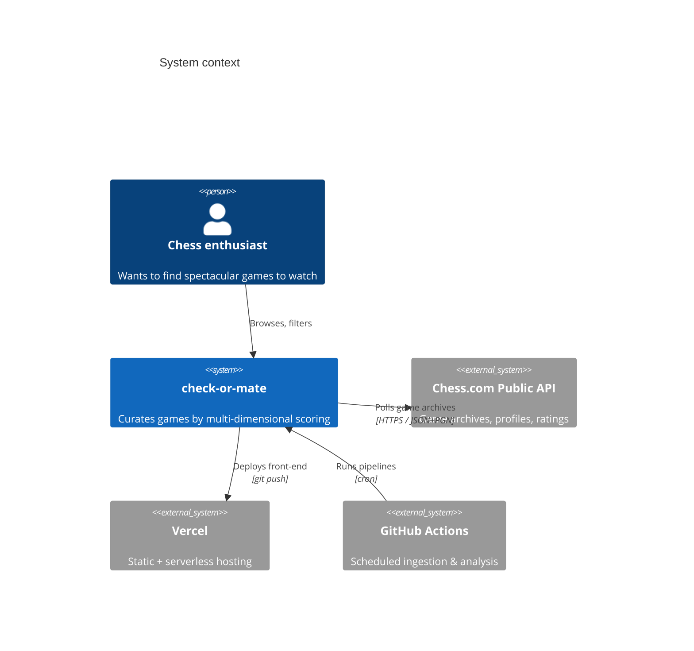
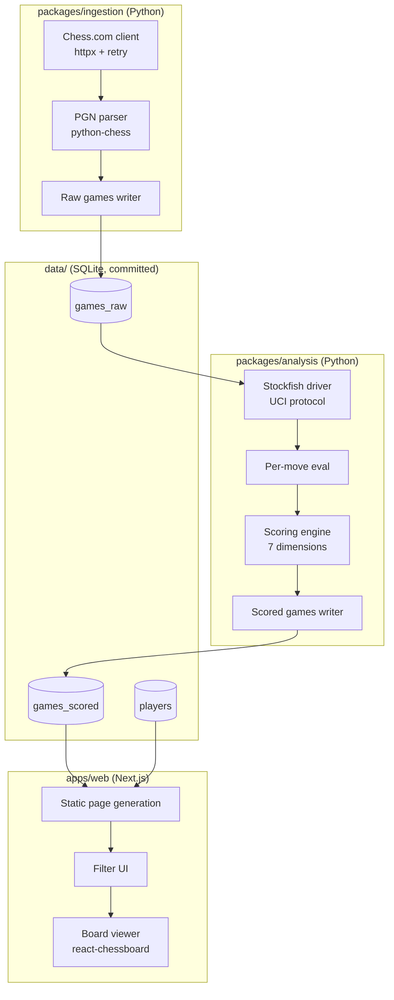

# Architecture

This document describes the design of `check-or-mate` at a level useful for contributors and reviewers. For the *why* behind each major choice, see the [ADRs](./adr/).

---

## 1. System context

`check-or-mate` sits between the Chess.com public API and an end-user browsing curated games. It is a **batch system with a static read model**: ingestion and analysis happen offline (on a schedule), and the front-end reads a pre-computed, denormalized database.



---

## 2. Component view

The system has three layers: **ingestion**, **analysis**, and **presentation**. Each is independently runnable and testable.



### 2.1 Ingestion (`packages/ingestion`)

**Responsibility:** acquire raw game data from Chess.com, normalize it, persist it. No game evaluation logic lives here.

Key modules:

- `client.py` — typed wrapper around the Chess.com REST API. Handles retries with exponential backoff, respects `Retry-After` headers, caches responses in `~/.cache/check-or-mate/` to allow idempotent re-runs.
- `parser.py` — wraps `python-chess` to extract structured data from PGN: moves with SAN, clock annotations, ECO code, termination reason.
- `models.py` — Pydantic models mirroring the API surface. Single source of truth for shared types (TypeScript types are generated from these via `datamodel-code-generator`).
- `cli.py` — `python -m ingestion ...` entry points used both locally and by the GitHub Actions workflow.

The ingestion is **incremental**: it queries `/pub/player/{username}/games/archives`, diffs against the locally known months, and only fetches what's missing. A `(player, year, month)` tuple is the unit of work.

### 2.2 Analysis (`packages/analysis`)

**Responsibility:** transform raw games into scored games. Stockfish is invoked here.

Pipeline per game:

1. **Replay** the game move-by-move using `python-chess`, computing material balance at each ply.
2. **Evaluate** every position with Stockfish at a fixed depth (configurable, default 18). Results cached by FEN hash so re-runs are cheap.
3. **Compute** the seven score dimensions defined in the README. Each is a pure function from the move list + eval list + game metadata.
4. **Normalize** scores against the rolling corpus (e.g., a sacrifice of -3 material is more impressive at 2700 than at 1500), then map to a 0–100 scale.
5. **Persist** the scored game.

Stockfish runs as a long-lived subprocess driven via UCI. The analysis pipeline parallelizes across games using a process pool. In the GitHub Actions workflow, this is further parallelized across runners with a `matrix` strategy.

### 2.3 Presentation (`apps/web`)

**Responsibility:** make scored games discoverable and watchable.

- Next.js 15 with the App Router, deployed to Vercel.
- Static generation: the committed `apps/web/data/scores.json` snapshot is read at build time (`src/lib/loadGames.ts`) and bundled with the build — no server runtime, no database connection at query time.
- For filtering, the scored-games array is queried client-side in memory — this avoids any server runtime and keeps the cost at zero. For corpora large enough that shipping the full JSON to the client becomes costly, this would move to a Vercel serverless function or an in-browser SQLite (`sql.js`) read model.
- Board UI: `react-chessboard` for rendering, `chess.js` for move validation and PGN replay.
- Styling: Tailwind + shadcn/ui for a modern, recognizable design language.

---

## 3. Data model

Three tables, denormalized for read speed (no joins required at query time on the hot path):

### `players`
```sql
CREATE TABLE players (
    username TEXT PRIMARY KEY,
    rating_blitz INTEGER,
    rating_rapid INTEGER,
    rating_bullet INTEGER,
    title TEXT,             -- "GM", "IM", null
    country TEXT,
    last_synced_at TEXT     -- ISO 8601
);
```

### `games_raw`
```sql
CREATE TABLE games_raw (
    id TEXT PRIMARY KEY,            -- Chess.com game UUID
    white TEXT NOT NULL,
    black TEXT NOT NULL,
    white_rating INTEGER,
    black_rating INTEGER,
    result TEXT,                    -- "1-0", "0-1", "1/2-1/2"
    eco TEXT,
    time_class TEXT,                -- "blitz", "rapid", "bullet", "daily"
    end_time INTEGER,               -- unix
    pgn TEXT NOT NULL,
    fetched_at TEXT NOT NULL
);
CREATE INDEX idx_games_raw_white ON games_raw(white);
CREATE INDEX idx_games_raw_black ON games_raw(black);
```

### `games_scored`
```sql
CREATE TABLE games_scored (
    id TEXT PRIMARY KEY REFERENCES games_raw(id),
    -- Seven score dimensions, 0-100
    sacrifice_score REAL,
    eval_swing REAL,
    brilliancy REAL,
    time_pressure REAL,
    endgame_quality REAL,
    rating_upset REAL,
    opening_rarity REAL,
    -- Derived
    overall_score REAL,             -- weighted blend, default weights in config
    -- Provenance
    stockfish_version TEXT,
    stockfish_depth INTEGER,
    analyzed_at TEXT NOT NULL
);
CREATE INDEX idx_scored_overall ON games_scored(overall_score DESC);
```

The schema lives in `packages/analysis/schema.sql`. Migrations are forward-only and named `NNNN_description.sql`.

---

## 4. Workflows (GitHub Actions)

Four workflows, each with a single responsibility:

| File | Trigger | Purpose |
|---|---|---|
| `ci.yml` | push, PR | Lint, type-check, unit tests for all packages |
| `ingest.yml` | cron daily 04:00 UTC, manual | Fetch new games, commit to `data/games.db` |
| `analyze.yml` | after ingest succeeds, manual | Run Stockfish analysis on un-scored games |
| `release.yml` | tag push `v*` | Generate changelog, create GitHub Release |

The ingest + analyze workflows commit changes back to `main` using a bot identity. Concurrency groups prevent overlapping runs. Failed runs notify via GitHub issue creation.

---

## 5. Non-functional requirements

| Requirement | Target | How achieved |
|---|---|---|
| Cold-start build | < 5 min | SQLite bundled, no DB connection at build time |
| Front-end TTI | < 2 s on 3G | Static gen, code splitting, no SSR |
| Ingestion correctness | Idempotent re-runs | Content-addressed cache + UUID primary keys |
| API politeness | Respect Chess.com TOS | Honor `Retry-After`, single-flight requests, user-agent identification |
| Reproducible analysis | Same input → same output | Pinned Stockfish version, recorded depth |
| Cost | $0 / month | GitHub Actions + Vercel + Pages free tiers |

---

## 6. Out of scope (for now)

These are explicit non-goals, documented to anchor the scope:

- **Real-time game tracking** — Chess.com offers no streaming API; polling is the only option.
- **User accounts / personalization** — the curation model is global, not per-user. Personalization would require a back-end with state.
- **Engine analysis on demand** — Stockfish runs server-side in CI, not in the browser. A future `analyze this game` button could use Stockfish-WASM.
- **Lichess support** — Lichess has a great API and would be a natural extension, but multiplies the surface area. Tracked as a stretch goal.

---

## 7. Glossary

- **PGN** — Portable Game Notation, the text format for chess games
- **FEN** — Forsyth-Edwards Notation, a string describing a single board position
- **ECO** — Encyclopedia of Chess Openings code (e.g., `B90` = Sicilian Najdorf)
- **UCI** — Universal Chess Interface, the protocol Stockfish speaks
- **Centipawn (cp)** — 1/100 of a pawn; standard unit for engine evaluation
- **ADR** — Architecture Decision Record; see [docs/adr/](./adr/)
